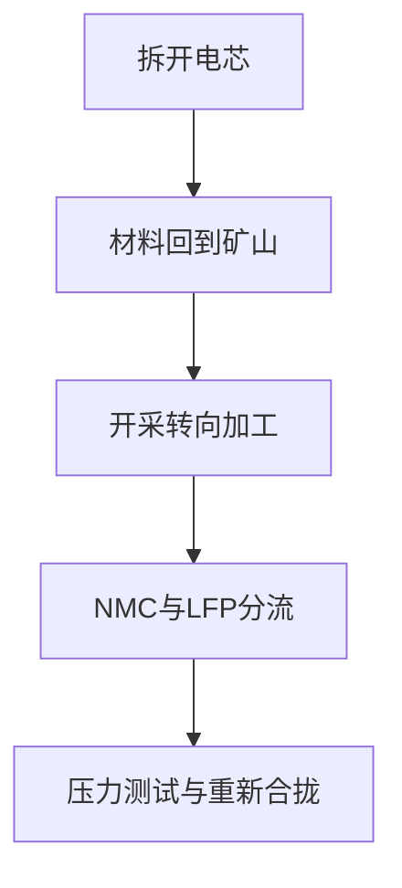

# 《拆开一块电池，里面藏着一张世界地图》逐章故事板与页面线框 v2

> 文档性质：逐章叙事、页面状态、交互与响应式线框  
> 上游依据：`01-concept-design-v1.md`、`story-brief.md`、`data-notes.md`  
> 状态：用户已确认；网页实现严格依据本 v2  
> 更新日期：2026-07-28

## 1. v2 设计目标

v2 将 v1 的十个模块落实为 14 个可实现的页面场景。每个滚动步骤只推进一个论点，并回答以下问题之一：

- 电池里有什么？
- 这些材料从哪里开采？
- 它们在哪里被加工？
- 更换化学路线会改变什么？
- 供应链集中意味着什么，又不意味着什么？
- 除了挖更多矿，还有哪些响应路径？

全篇以一枚“参考方形电芯”为持久视觉对象。电芯中的材料从剖面移动到地图、供应链阶段和路线比较器，再在结尾回到电芯。任何材料都不被变形成无关的统计对象。

## 2. 全页信息架构

### 2.1 页面顺序

1. 站点导航与故事标题；
2. Hero：密封电芯；
3. 电芯拆解；
4. 材料功能；
5. 2025 年开采地图；
6. 开采/加工双层地图；
7. 四阶段供应链；
8. 钴与刚果（金）案例；
9. NMC/LFP路线比较；
10. 供应链压力测试；
11. 多元化与回收；
12. 电芯重新合拢；
13. 方法、来源和数据下载；
14. 返回 DataSlices 其他故事。

### 2.2 固定导航

- 左上：`数据切片 DataSlices`，点击返回首页；
- 右上：章节进度 `01 / 10`；
- 桌面端右侧细进度轨，显示当前位置，不作为强制导航；
- 手机端使用顶部 2px 阅读进度条，不占用正文空间；
- 方法入口在第一处数据图和页尾均出现；
- 不设置悬浮分享按钮，不遮挡图形和文字。

### 2.3 阅读节奏

| 区段 | 场景 | 视觉密度 | 预计时间 |
|---|---:|---|---:|
| 具体开场 | 0—2 | 高 | 90—120 秒 |
| 地理揭示 | 3—5 | 高 | 150—190 秒 |
| 人与制度 | 6—7 | 中低 | 85—110 秒 |
| 技术选择 | 8—10 | 高 | 150—200 秒 |
| 回收与结尾 | 11—13 | 中低 | 100—130 秒 |

目标总阅读时间仍为 8—10 分钟，发布前以至少五名首次阅读者的活跃阅读时间中位数为准。

## 3. 持久视觉语法

### 3.1 材料身份

| 材料 | 颜色 | 形状/纹理 | 主要出现位置 |
|---|---|---|---|
| 锂 | 浅青白 | 空心圆 | 阴极、开采地图、两种路线 |
| 钴 | 深蓝 | 六边形 | NMC、刚果（金）案例 |
| 镍 | 绿色 | 斜线纹 | NMC、印度尼西亚加工 |
| 锰 | 紫色 | 十字纹 | NMC、路线比较 |
| 石墨 | 近黑 | 水平层纹 | 阳极、加工集中 |
| 铜 | 橙铜 | 实心圆 | 集流体、辅助材料 |
| 铝 | 银灰 | 点纹 | 集流体、外壳 |
| 铁 | 暖黄 | 方形 | LFP |
| 磷 | 金黄 | 三角形 | LFP |

### 3.2 数字层级

- 页面大数字只显示当前场景最重要的一个事实；
- 国家份额保留整数，源数据若为估算则标 `约`；
- 份额加总因四舍五入不等于 100% 时，不强行调整；
- 历史观察使用实线，情景预测使用虚线；
- “不可计算”优先于填补一个没有来源的值；
- 每张图就地标注年份、单位和数据口径。

### 3.3 动效时长

- 普通状态切换：240—420ms；
- 地图阶段迁移：550—750ms；
- Hero拆解：由滚动步骤触发的离散状态，不绑定每一个滚轮像素；
- 动画可以被下一次输入打断；
- `prefers-reduced-motion` 下直接显示目标状态并保留连接线和注释。

## 4. 逐场景故事板

### 场景 0：封面——只有一个产地？

**读者文案**

> # 拆开一块电池，里面藏着一张世界地图
>
> 从一枚电芯出发，沿着锂、钴、镍和石墨，穿过一条比产品本身大得多的全球供应链。

标题下方：

> 它看起来只有一个产地。沿着材料往回走，却会经过矿山、精炼厂、材料工厂和电芯厂。

**桌面视觉**

- 全屏暖灰实验台背景；
- 一枚方形电芯占画面宽度约 36%，略偏左；
- 电芯表面只有极小的 `REFERENCE CELL` 字样，避免像真实品牌广告；
- 右下出现“向下滚动，打开电芯”，不使用跳动箭头。

**手机视觉**

- 标题在上，电芯位于下半屏；
- 首屏允许看到下一段顶部，提示页面可以自然滚动；
- 不使用固定 100vh，采用 `min-height: 100svh` 与内容驱动高度。

**进入下一状态**

电芯外壳沿真实结构分离，回答“它由什么组成”。

### 场景 1：拆开外壳

**读者文案**

> “锂电池”听起来像是一种材料。  
> 实际上，它是一组被压紧、卷绕或叠放在一起的功能层。

**视觉状态**

电芯由外到内展开为：

1. 外壳；
2. 铝集流体；
3. 阴极材料；
4. 隔膜；
5. 石墨阳极；
6. 铜集流体；
7. 电解液说明层。

每层旁边只显示名称和功能，不在此处堆放国家数据。

**读者操作**

可点按一层查看一句解释；默认按叙事顺序自动突出当前层，不要求点击才能继续。

**过渡意义**

产品的“完整”被拆成不同功能，准备建立材料身份。

### 场景 2：九种材料，各自承担什么

**读者文案**

> 真正决定路线差异的，主要是阴极。  
> 但无论选择哪条主流锂离子路线，一块电池都远不止“锂”。

**视觉状态**

- 电芯剖面缩到左侧；
- 右侧出现九种材料的纵向索引；
- 鼠标、键盘或触摸选择材料时，电芯中对应位置加粗；
- 默认聚焦锂，然后依次介绍石墨、镍、钴、锰、铁、磷、铜、铝。

**资料标签**

`参考结构，不代表所有品牌和型号。物料比例将在方法中按电芯模型列出。`

**过渡意义**

材料从“电池内部功能”转为可以被地理定位的对象。

### 场景 3：材料回到矿山

**读者文案**

> 先只问最简单的问题：2025年，这些材料从哪里被开采出来？

**默认状态**

- 默认材料：钴；
- 左侧/上方：Equal Earth世界地图；
- 右侧/下方：前五生产国排序和“其他国家”；
- 地图和排序共享同一份 USGS 2025 年矿山产量数据。

**控件**

材料标签：`锂｜钴｜镍｜石墨｜锰｜铜`

**地图编码**

- 圆点面积代表产量，不使用国家填色深浅暗示面积等于产量；
- 当前材料颜色填充圆点；
- 排名列表显示国家、产量、全球份额和估算标记；
- 小国可以通过列表选择，地图不是唯一操作入口。

**同屏来源**

`矿山产量估算，2025年。来源：USGS Mineral Commodity Summaries 2026。`

**过渡意义**

读者形成第一张供应地理图，但下一场立即挑战“矿产地就是供应链控制点”的直觉。

### 场景 4：同一种材料，两张地图

**读者文案**

> 但矿石离开地下，还不能直接进入电池。  
> 从矿山到电池级材料，中间还有一张不同的地图。

**核心互动：开采 / 加工**

顶部使用两段式按钮：

`① 开采` → `② 精炼与材料加工`

默认先显示钴，再由叙事切换镍和石墨。

**视觉状态**

- 地图上的材料标记从开采国移动到加工国；
- 下方一条对齐份额带显示前三大国家和“其他”；
- 右侧大数字依次出现：
  - 前三大精炼国平均份额约 `86%`（2024）；
  - 前三大矿山国平均份额约 `77%`（2024）。

**关键文案**

> 地下有什么，决定了矿山在哪里。  
> 谁能把它变成电池级材料，则由另一套工业能力决定。

**口径说明**

86%和77%是 IEA 对六类关键能源矿物计算的综合指标，不代表每一种材料都恰好达到该比例。

**移动端**

不同时显示两张完整地图。使用同一地图分步切换，并保留下方国家份额带，帮助读者追踪变化。

### 场景 5：一块电池有四个“产地”

**读者文案**

> “产自哪里”至少可以有四种答案。

**视觉状态**

材料流从左到右经过四列：

1. 开采；
2. 精炼或化学转化；
3. 阴极/阳极材料；
4. 电芯制造。

**读者操作**

选择 `锂｜钴｜镍｜石墨`，查看该材料在四个阶段的主要国家和数据口径。

**流带规则**

- 有可核验贸易或物料流数据时，宽度才表示流量；
- 只有阶段份额时，使用同宽连接线，节点面积表示该阶段份额；
- 计划项目以虚线边框出现；
- 不把产能当成产量。

**错误/缺失状态**

当某阶段无法建立公开流向：

> 公开数据可以说明这一阶段集中在哪里，但不足以追踪这批材料最终进入哪家电芯厂。

**过渡意义**

从国家统计进入具体供应链限制，准备聚焦钴案例。

### 场景 6：钴的74%

**读者文案**

> 2025年，全球约74%的钴开采发生在刚果民主共和国。

第二段：

> 这个数字说明供应集中，却没有告诉我们钴由谁开采、怎样进入正式供应链，也没有告诉我们当地获得了多少加工价值。

**视觉状态**

- 全球钴点阵由100个六边形组成；
- 约74个移动到刚果（金）轮廓内；
- 剩余点按其他生产国分组；
- 不使用国土面积填色。

**来源**

UNCTAD 2026，并与 USGS 2026 年报交叉核对。

**过渡意义**

把抽象的全球份额变成一个可以看见的集中结构，但不由此推断劳工状况。

### 场景 7：一个国家，不止一种采矿体系

**读者文案**

> “来自刚果（金）”不是一种统一的生产方式。

页面区分：

- 大型工业采矿；
- 手工及小规模采矿；
- 正式追溯链；
- 难以追踪的非正式流通。

**视觉状态**

- 使用四条并行路径，而不是人物苦难照片；
- ILO记录的童工风险只连接到手工及小规模采矿相关路径；
- 每条路径显示“我们知道什么”和“数据没有告诉我们什么”。

**核心句**

> 供应链很容易统计国家份额，却很难自动看见材料经过了谁的手。

**阅读节奏**

本场景不使用滚动动画，只使用轻微高亮，为读者留出阅读时间。

### 场景 8：保持外形，换掉阴极

**读者文案**

> 如果绕开钴，供应链会不会简单很多？

**核心互动：NMC / LFP**

中央仍是开场时同一枚参考电芯。

两段式按钮：

`NMC 三元路线` ｜ `LFP 磷酸铁锂`

**NMC状态**

- 阴极展开为锂、镍、锰、钴；
- 阳极保持石墨；
- 地图突出对应开采和加工节点。

**LFP状态**

- 镍、锰、钴退出阴极；
- 铁和磷进入；
- 锂与石墨保留；
- 旁注说明不同路线仍有多种子型号。

**关键文案**

> LFP绕开了镍和钴，却没有绕开锂、石墨和电池级材料加工。

**过渡意义**

材料依赖不是简单减少，而是重新配置。

### 场景 9：成本、密度和地理不能压成一个总分

**读者文案**

> 换路线不是只换一张矿物清单。

**视觉状态**

NMC与LFP使用同尺度小倍数，分别比较：

- 主要阴极材料；
- 典型质量能量密度范围；
- 2025年平均每kWh价格差异；
- 主要生产或加工集中度；
- 适合回答与不适合回答的问题。

**禁止设计**

- 不制作单一“综合优劣分数”；
- 不把成本、能量密度、劳工风险和国家集中度加权成一个排名；
- 不将路线选择描述为个人消费者能够单独决定的道德测试。

**过渡意义**

为压力测试提供多个独立维度，而不是制造一个伪客观结论。

### 场景 10：供应链压力测试

**读者文案**

> 集中度真正意味着什么？  
> 先做一个有限、透明的假设：暂时拿掉一个主要供应节点，其他国家的产量保持不变。

**默认状态**

- 路线：NMC；
- 阶段：精炼/加工；
- 情景：无中断；
- 页面先显示完整供应结构。

**控件**

1. 电池路线：`NMC / LFP`
2. 阶段：`开采 / 加工`
3. 节点：从当前主要国家中选择一个
4. `恢复基准`

**输出**

- 暴露的材料；
- 选中节点占该材料全球供应的份额；
- 其余前三个来源及份额；
- 数据缺口；
- 固定声明：`这不是停产、价格或替代速度预测。`

**视觉状态**

- 受影响节点变为空心轮廓；
- 对应材料流带变暗但不消失；
- 未受影响材料保持原色；
- 右侧不显示“失败/成功”，避免游戏化供应冲击。

**分享状态**

参数可以写入 URL，例如：

`?chemistry=nmc&stage=refining&node=IDN`

页面刷新后恢复同一情景。

### 场景 11：四条不同的回应路径

**读者文案**

> 面对集中供应链，“再找一座矿”只是其中一种答案。

**视觉状态**

四条垂直路径：

1. 更多开采来源；
2. 更多加工地点；
3. 更少的单位材料需求；
4. 回收与再利用。

每条路径都列出：

- 能解决什么；
- 不能解决什么；
- 需要多长的产业链环节；
- 当前可观察指标。

**回收子场景**

一枚退役电芯拆成：

- 可收集；
- 可分选；
- 可回收材料；
- 损耗和未回收；
- 回到新电池材料的部分。

只显示流程，不在数据不足时虚构闭环率。

### 场景 12：把世界重新放回电池

**读者文案**

> 我们买到的是一块电池。  
> 世界为它准备的，却是一整套地理、工业和选择。

第二屏：

> 真正的问题不是怎样让电池“不再需要世界”，而是怎样让这张世界地图更透明、更多元，也更能承担自己的代价。

**视觉状态**

- 地图上的材料标记沿原路径返回电芯；
- 电芯重新合拢；
- 每一层边缘保留极细的国家和阶段标签；
- 不再自动循环播放。

**结尾行动**

三个非命令式入口：

- `重新拆开这块电池`
- `查看完整数据与方法`
- `阅读数据切片的其他故事`

### 场景 13：方法、来源与数据

**布局**

正文结束后使用普通文档流，不再 sticky：

- 数据年份和访问日期；
- 参考电芯模型；
- 矿山、精炼、产能与贸易口径；
- 压力测试公式；
- 已知限制；
- 来源清单；
- 可公开再分发的数据下载；
- GitHub设计稿和代码。

**核心声明**

> 无来源的环节不画成流量；无法计算的结果明确显示为不可计算。

## 5. 桌面端页面线框

### 5.1 Hero

| 区域 | 宽度/位置 | 内容 |
|---|---|---|
| 顶部导航 | 全宽，56px | 品牌、章节进度、方法入口 |
| 标题区 | 左侧 44% | 标题、副标题、开场句 |
| 电芯视觉 | 右侧 48% | 方形参考电芯 |
| 滚动提示 | 标题下方 | 简短文字，不使用循环箭头 |

### 5.2 标准滚动叙事

| 区域 | 桌面布局 |
|---|---|
| 图形 | 左侧约 60%，`position: sticky`，可用高度不超过 `calc(100dvh - 72px)` |
| 文字步骤 | 右侧约 34%，每步最少 65svh，卡片背景尽量透明 |
| 来源 | 图形左下，同屏可见 |
| 控件 | 图形下方或右上固定区域，不与步骤文字重叠 |

### 5.3 全宽互动

NMC/LFP比较器和压力测试退出双栏滚动布局，采用：

- 上方短导语；
- 中部全宽图形；
- 图形下方固定顺序控件；
- 结果和限制并列；
- 读者完成或跳过互动都可以继续向下阅读。

### 5.4 安静章节

钴劳工语境、方法与结尾使用约 680px 正文宽度，减少图形运动，避免整篇持续高刺激。

## 6. 手机端页面线框

| 场景类型 | 手机布局 |
|---|---|
| Hero | 标题在上，电芯在下；允许自然超过一屏 |
| 电芯拆解 | 图形可短暂 sticky，最高 46svh；文字步骤位于下方 |
| 世界地图 | 地图概览在上，国家排名列表在下；列表也是主要选择器 |
| 开采/加工 | 同一地图分步切换，不并排显示 |
| 四阶段流程 | 每次聚焦一个阶段，顶部显示四段进度 |
| NMC/LFP | 电芯在上，材料列表在下；切换按钮固定在图形下方 |
| 压力测试 | 控件按路线→阶段→国家纵向排列；结果紧随控件 |
| 方法 | 普通单栏文档流 |

手机端正文不小于 17px，行长约 20—24 个汉字。sticky 失效时，每个步骤显示完整静态状态，不依赖观察器才能理解。

## 7. 交互默认状态与异常状态

### 默认

- 开采地图：钴、2025、矿山产量；
- 双层地图：先开采，滚动后切到加工；
- 路线比较：NMC；
- 压力测试：NMC、加工、无中断；
- 所有模块无需操作也能读完主要论点。

### URL状态

只把真正有解释价值的选择写入 URL：

- `material`
- `stage`
- `chemistry`
- `node`

### 空状态

没有加工数据时：

> 当前公开来源不足以用同一口径展示这一材料的加工国家份额。

### 错误状态

数据文件加载失败时：

- 保留章节正文；
- 显示预生成的静态关键结论；
- 提供数据表链接；
- 不显示空白画布。

### 重置

每个大型互动均有文字明确的“恢复基准”，不使用只有图标的重置按钮。

## 8. 无障碍验收要求

- 页面标题层级连续；
- 所有按钮有可见焦点；
- 材料颜色同时配合形状、纹理和文字；
- SVG具有名称和一句话结论；
- Canvas若使用，必须同时提供可导航数据表；
- 地图国家可通过列表和键盘选择；
- 状态改变使用克制的 `aria-live="polite"` 摘要，不逐项朗读动画；
- 200%缩放下不丢失控件；
- 减少动态模式保留所有状态和过渡含义；
- 触控目标至少44×44 CSS px。

## 9. 数据—视觉对应

| 页面视觉 | 首选数据 | 不足时的退化方案 |
|---|---|---|
| 电芯剖面 | Argonne BatPaC/GREET参考物料 | 只显示结构和材料集合，不显示质量 |
| 开采地图 | USGS MCS 2026 | 显示前五国及“其他”，不补齐缺失国家 |
| 加工地图 | IEA公开数据 | 使用已发布集中度和主要国家，不伪造完整流向 |
| 四阶段流图 | IEA、UNCTAD贸易及产能数据 | 改为阶段节点图，连接线不编码流量 |
| 钴74% | UNCTAD，USGS交叉核对 | 若数值修订，使用最新版并保留访问日期 |
| NMC/LFP | IEA、UNCTAD、Argonne | 只显示材料有无和定性差异 |
| 压力测试 | 国家份额长表 | 只开放数据完整的材料和阶段 |
| 回收 | IEA回收能力数据 | 只画流程，不显示闭环比例 |

## 10. v2确认后的实施顺序

用户确认 v2 后才进入开发，并严格按以下顺序：

1. 冻结数据来源和许可；
2. 下载、清洗并生成版本化数据快照；
3. 编写 `manuscript.md`、`methodology.md`、`sources.md`；
4. 建立设计—实现追溯表；
5. 实现语义HTML和静态无脚本阅读顺序；
6. 实现电芯剖面；
7. 实现开采/加工地图；
8. 实现路线比较和压力测试；
9. 完成手机端、键盘和减少动态模式；
10. 运行数据、交互、性能和故事审计；
11. 在不覆盖旧故事的前提下更新首页；
12. GitHub Pages发布并逐一验证全部故事路径。

## 11. 本阶段确认范围

请用户重点确认：

1. 是否以电动车参考电芯为主，而不是手机电池；
2. 十章、14场景的叙事顺序；
3. 钴案例是否保留；
4. NMC/LFP比较是否作为中心互动；
5. 压力测试是否只做静态暴露，不做价格预测；
6. 明亮实验台到深色世界地图的视觉方向；
7. 手机端采用地图加排序列表，而不是缩小桌面地图。

确认后，网页开发必须以本文件作为直接依据。任何重大结构变化都应先更新设计稿。
